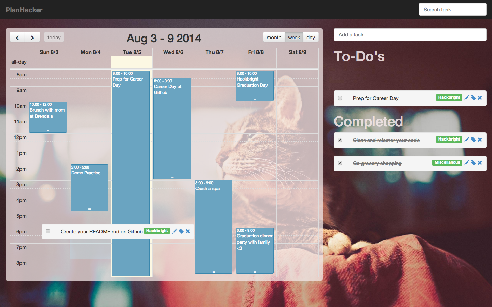

# PlanHacker

PlanHacker is a mash-up between two stand-alone apps: a calendar and a
to-do list. PlanHacker is an all-in-one productivity web app that gives users a
new and awesome way of planning and getting things done with online
collaboration.

## Overview

* Single-page web app built using AngularJS
* Real-time data updates using [Firebase][]
* AngularFire provides native *three-way* Angular bindings to Firebase
* Deployed using GitHub Pages

## The Story Behind PlanHacker

Hi, I am Kimberly Lin, aka Kiki. I recently attended [Hackbright
Academy][Hackbright] in San Francisco, CA and this is my Hackbright project. In
college, it can be overwhelming to juggle your time between lots of homework,
preps for exams or quizzes, projects that involve team collaborations, and of
course hanging out with your friends. Sometimes, I have a to-do list handy in
my pocket to keep track of what I need to do. Sometimes, I put things down in
my calendar for meet-ups and important events. However, I regrettably forget to
put down everything in the right places, so they are no longer in sync.

While at Hackbright, I set out to create a simple yet powerful web app with a
great user experience. Because I am a problem solver and planning has been a
pain in the butt for me, I decided to take my problem and turn it into a
project: I coded into life everything that I look for in a planner, my dream
planner. Hence, **my** PlanHacker.

## My Vision With PlanHacker

I plan on making my project highly collaborative among its users. For example,
if we attend the same university and have a few classes together, then we can
intertwine our planners. In doing so, as soon as I enter a to-do in my planner
for the same class we share, that to-do will show up on your planner
immediately for you to accept or decline the new addition to your planner.
This applies to creating events related to the same class as well.  One of
my goals is to make this easy for users to crowdsource their planners
together, for both academic and social purposes.

I want to make my project very human-centered by allowing users to post their
progress on PlanHacker on social medias, including Facebook, Twitter, and
Linkedin. For example, a college student can make post on his or her completion
of the finals on Facebook, "I am done with all my finals. I am finally free!!!"

Another idea that I really want to pursue as I get further in my project is to
create a sharing platform for users to overlap their schedules together so that
friends can quickly figure out available times to hang out by just looking at
their combined calenders. It sure beats the repetitive back-and-forth "Ok, you
are not free at this time. So…are you free at this time?"

## Technology Stack

The two major technology choices I made were **AngularJS** and **Firebase**.
AngularJS allows me to create a modern web app that's responsive on all types
of devices, since almost all user interactions happen directly in the browser,
rather than having to go to a backend application server.

Firebase is a real-time cloud based storage, which is key for the planned
collaborative features. As soon as I create or edit an event or to-do, that
change is instantly pushed out to all users of the system (who care about those
changes, of course!). For example, when the professor postpones an exam by a
week and I update my planner with the information, everyone else in the class
instantly benefits by being notified of the change.

Working with the asynchronous nature of AngularJS and its three-way binding 
was mind-boggling at first, but rewarding once I understood the premise of 
the `$promise` system. Similarly, working with the non-relational structure 
of Firebase, and the very simple object and array data responses were quite 
the departure from SQLite, which I learned during my studies at Hackbright. 
The constantly shifting Firebase API didn't make the work any easier, but it 
taught me to value the importance of adaptability to new changes.

The rest of the technology stack played a supporting role, given the time
constraint of 5 weeks, I opted to use the jQuery-based [FullCalendar][]. If I
had more time, I definitely would have opted for a native AngularJS-based
solution.

Here's the rest of the stack:

* AngularFire: This provided native 3-way bindings to Firebase in AngularJS
* AngularUI Boostrap: Instead of using Bootstrap's JavaScript, let's use native
  AngularJS directives
* Bootstrap: It's much faster to prototype when the provided CSS
  framework does the right thing with some tweakings.
* CSS: Sprinkled in some custom CSS where Bootstrap just didn't do.
* HTML: Of course, it's a must, especially with AngularJS.
* JavaScript: Created functions for event handlers in the calendar.
* JSON: Parsed, sliced, and modified the data from Firebase.

## Deployment

I deployed it on GitHub Pages. Visit here at [PlanHacker][]. Don't forget to play around and drag a task onto the calendar. Enjoy!

## Install

1. Download my program in your computer.
2. Navigate to my folder in the terminal.
3. Type in terminal after $, "python -m SimpleHTTPServer". If you do not see something like "Serving HTTP on 0.0.0.0 port 8000 ...", then try again. Otherwise, you are doing great.
4. Type in Chrome, "http://localhost:8000/#/plan". If you want to see login webpage, then type "http://localhost:8000/#/login" (The login page is still a work in progress).
5. Enjoy!

## Question or Feedback?

Contact Kimberly Lin at kimberlylin90@gmail.com. Thank you. :-)

[Firebase]: https://www.firebase.com
[FullCalendar]: http://arshaw.com/fullcalendar/
[Hackbright]: http://www.hackbrightacademy.com
[PlanHacker]: http://kikilin90.github.io/PlanHacker/#/plan

## Copyright

Copyright © 2014, by Kimberly Lin. All rights reserved.
